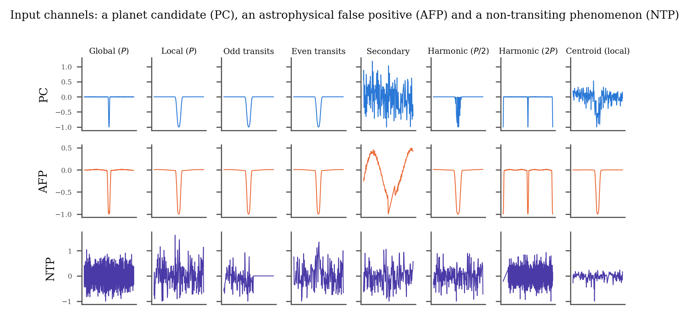
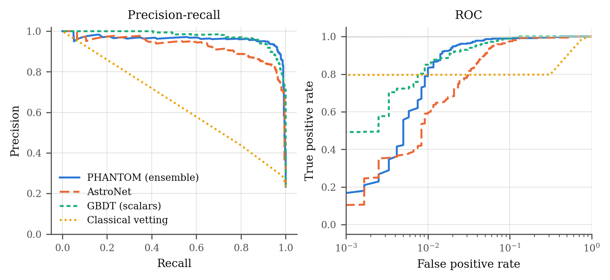
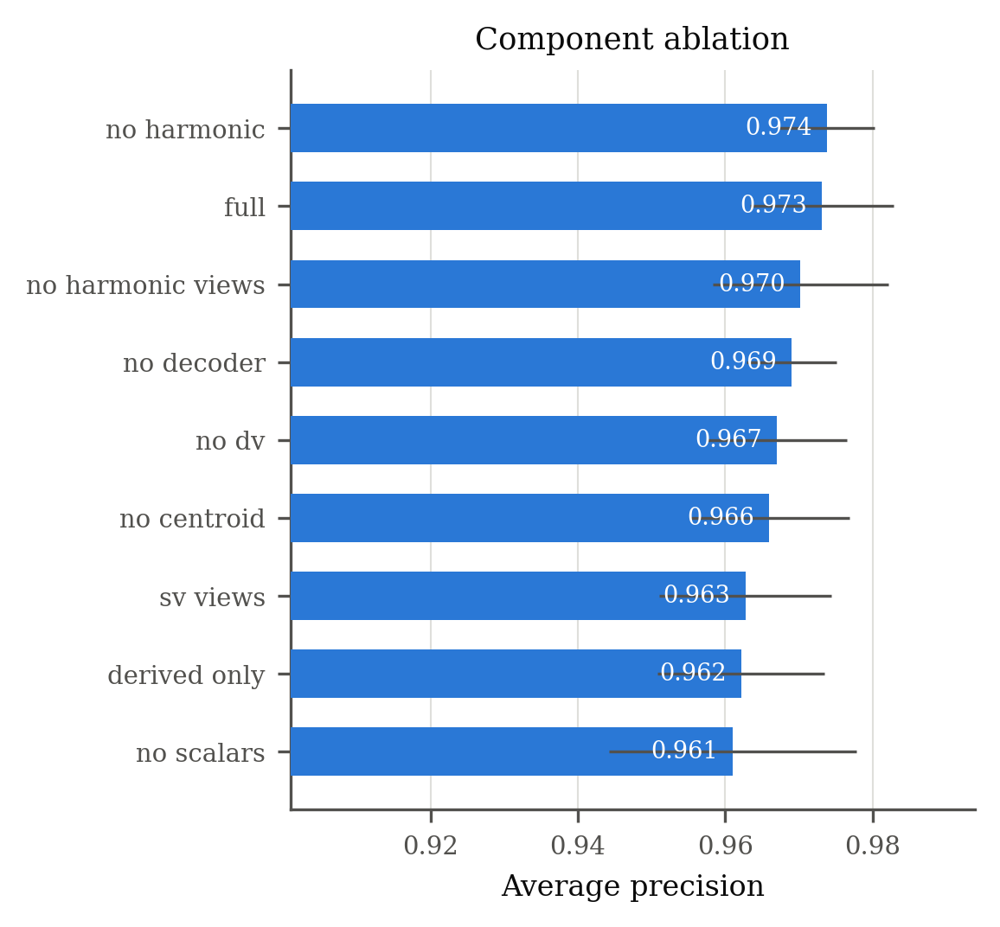
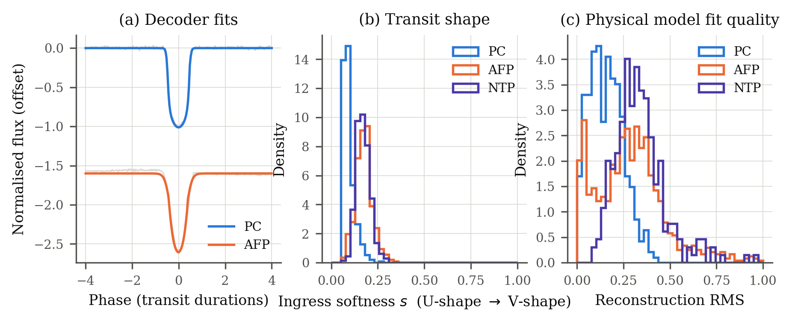
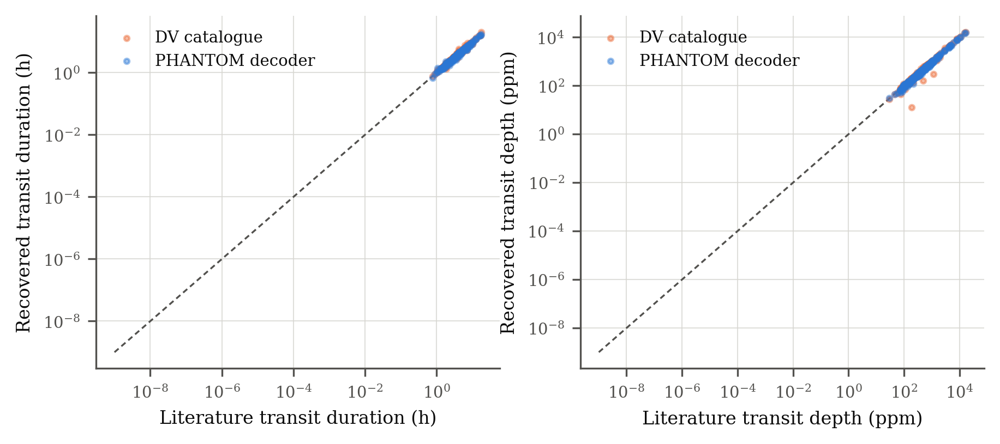
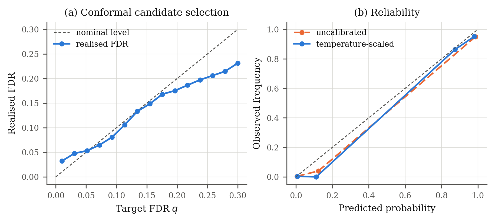
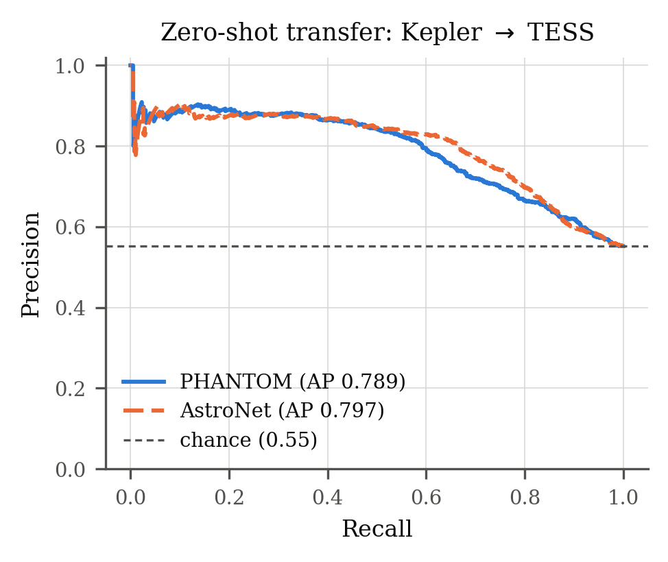

<h1 align="center">PHANTOM</h1>

<p align="center">
  <b>P</b>hysics-informed <b>H</b>armonic <b>A</b>ttention <b>N</b>etwork for <b>T</b>ransit <b>O</b>bject <b>M</b>odelling
</p>

<p align="center">
  <i>Multi-channel neural vetting of exoplanet transit candidates:<br>
  controlled ablations and distribution-free candidate selection</i>
</p>

<p align="center">
  
  
  
  
  
  
</p>

---

Space telescopes flag millions of possible planetary transits. Most are false
alarms — eclipsing binaries, blends, aliases, instrument systematics. Sorting
them is the bottleneck between raw photometry and a planet catalogue.

**PHANTOM** views every candidate through **nine** phase-folded representations
at once and lets a transformer decide which to trust, with a differentiable
analytic transit model attached as a physics bottleneck.

On the standard Kepler DR24 benchmark it beats a faithfully reimplemented
AstroNet using **13% fewer parameters**, and at the recall astronomers actually
operate at it **cuts wasted follow-up observations by 62%**.

> 📖 **New here?** Read [`explain.md`](explain.md) — the whole project in plain
> language, including an honest assessment of what is and isn't novel.
> 📄 The manuscript is in [`paper/main.tex`](paper/main.tex) (23 pages).

---

## The nine views

Each is designed to expose one specific class of impostor.



*The nine input channels for a planet candidate, an astrophysical false
positive, and a non-transiting phenomenon.*

| View | Bins | Catches |
|---|---|---|
| `global` | 2001 | Overall orbit shape, secondary eclipses |
| `local` | 201 | Depth, duration, ingress shape |
| `odd` / `even` | 201 | Eclipsing binaries with alternating depths |
| `secondary` | 201 | Self-luminous companions |
| `half` / `double` | 201 / 2001 | Period aliases at *P*/2 and 2*P* |
| `cent_global` / `cent_local` | 2001 / 201 | Background blends (centroid shift) |

Views are encoded independently into tokens, then combined by a transformer, so
the model can learn conditional logic — *"the centroid channel is noisy here,
lean on odd/even instead"* — that a fixed concatenation cannot express.

---

## Results

All models trained on **identical splits**, **five seeds**, star-level grouping,
same preprocessing. 15,683 labelled Kepler DR24 threshold-crossing events.

| Model | Params | AUC | Average precision | P @ 95% recall |
|---|---|---|---|---|
| Classical cascade | — | 0.7668 ± 0.0162 | 0.4017 ± 0.0193 | 0.271 |
| AstroNet (reimplemented) | 10.55 M | 0.9825 ± 0.0028 | 0.9385 ± 0.0093 | 0.805 |
| GBDT on summary statistics | — | 0.9923 ± 0.0025 | **0.9754 ± 0.0056** | 0.902 |
| **PHANTOM** | **9.16 M** | **0.9929 ± 0.0027** | 0.9732 ± 0.0097 | **0.927** |

At 95% recall AstroNet's candidate list is **19.5% junk**; PHANTOM's is
**7.3%**. Gap over AstroNet: **+0.0347 AP**, *p* = 4 × 10⁻⁴ across five seeds.

<table>
<tr>
<td width="50%"></td>
<td width="50%"></td>
</tr>
<tr>
<td><b>Precision–recall and ROC</b> on the held-out test set.</td>
<td><b>Component ablations</b> with five-seed error bars — every interval overlaps.</td>
</tr>
</table>

### The physics bottleneck works

A five-parameter analytic transit model is attached as a decoder and trained by
**reconstruction only** — it never sees a parameter label. Afterwards, its
invented parameters are compared against published values for the 264 confirmed
planets in the test split.

<table>
<tr>
<td width="50%"></td>
<td width="50%"></td>
</tr>
</table>

| Estimator | Duration error | Depth error |
|---|---|---|
| Kepler DV catalogue (full physical fit) | 2.0% | 3.3% |
| **PHANTOM decoder (never supervised)** | **3.2%** | **6.5%** |

It is not a better parameter estimator and we don't claim it is. It shows the
latent space encodes transit *geometry*, not an arbitrary code — which is what
makes the model interpretable.

### Candidate lists with a guarantee

Conformal *p*-values with Benjamini–Hochberg turn scores into a list carrying a
promise: *"at most q of this list is expected to be junk."*



| Target *q* | Selected | Realised FDR | Recall |
|---|---|---|---|
| 0.01 | 181 | 0.033 ❌ | 0.478 |
| 0.05 | 353 | 0.057 ✅ | 0.910 |
| 0.10 | 389 | 0.090 ✅ | 0.967 |
| 0.20 | 449 | 0.194 ✅ | 0.989 |

Control holds at 5% and above and **fails below it**. We report the failure and
diagnose it rather than showing only the levels that worked.

### Cross-mission transfer fails

Kepler-trained models applied to 2,351 TESS objects of interest, no retraining:



| Model | AP on TESS |
|---|---|
| PHANTOM | 0.789 |
| AstroNet | 0.797 |
| Chance | 0.552 |

Both collapse and become indistinguishable. Corroborates Kopparapu et al. (2026).

---

## The negative results are the point

We ran eight ablations, five seeds each. **Not one is statistically
significant** (all *p* > 0.13) — yet the full model beats AstroNet decisively
and degrades monotonically as components are stripped. The evidence is
**redundant**: channels cover for each other.

The implication reaches past this paper. **Leave-one-out ablation — the standard
instrument for attributing credit in this literature — is close to
uninformative when evidence is redundant, and systematically understates
component value.**

Three more negatives, reported in full:

- **The leakage scare is unfounded.** Splitting by event instead of by star
  changes AP by 0.0002 (*p* = 0.97), despite 65.1% of events sharing a host star.
- **A decision tree ties the network** on average precision. It only loses at
  high recall — the regime that actually matters.
- **Conformal control has a floor** at *q* ≈ 0.05, for reasons we diagnose.

---

## Reproducing

**Tested on:** Python 3.10, PyTorch 2.12 + CUDA 13.0, 2× NVIDIA L40S.

```bash
pip install torch h5py lightgbm scikit-learn astropy numpy scipy pandas matplotlib
```

```bash
# 1. Catalogues from the NASA Exoplanet Archive  (~1 min)
bash scripts/fetch_catalogs.sh

# 2. Kepler light curves — 67.8 GB, 157,982 files  (~1.2 h at 16 MB/s)
python scripts/download_kepler.py

# 3. FITS → model input  (~11 min on 36 workers)
python scripts/preprocess.py --workers 36

# 4. The full experiment grid — 56 runs, resumable  (217 GPU-min, ~2 h on 2 GPUs)
python scripts/run_sweep.py --gpus 0,1

# 5. Baselines, aggregation, transfer, figures
python scripts/baselines.py --seed 0
python scripts/evaluate.py
python scripts/transfer_tess.py --tag phantom_derived_only
python scripts/figures.py
```

Progress at any time: `bash scripts/status.sh`
Step 4 is resumable — completed runs are skipped automatically, so it survives
interruption.

Build the paper:

```bash
cd paper && latexmk -pdf main.tex
```

---

## Layout

```
exonet/                  Library
├── model.py             PHANTOM: view encoders, transformer, transit decoder
├── views.py             The nine phase-folded representations
├── spline.py            BIC-selected cubic B-spline detrending
├── kepler_io.py         FITS reading, quality masking, gap splitting
├── pipeline.py          Shared view generation (Kepler and TESS)
├── data.py              Scalar conditioning, datasets, star-level splits
└── conformal.py         Conformal p-values, Benjamini–Hochberg, calibration

scripts/                 Executables
├── download_kepler.py   Resumable bulk download
├── preprocess.py        FITS → HDF5 views
├── train.py             One training run
├── run_sweep.py         The 56-run grid
├── baselines.py         Classical cascade + GBDT
├── evaluate.py          Aggregation and significance tests
├── transfer_tess.py     Zero-shot cross-mission evaluation
└── figures.py           All seven figures

paper/                   Manuscript (elsarticle) + figures
results/                 comparison.csv, summary.json, per-run JSON
explain.md               Plain-language explanation of the whole project
```

---

## Data

All public, nothing synthetic:

- **Kepler light curves** — MAST public S3 mirror, quarters Q0–Q17
- **DR24 TCE table with Autovetter labels** — the benchmark of Shallue &
  Vanderburg (2018)
- **KOI cumulative table, confirmed planets, TESS TOIs** — NASA Exoplanet Archive

Bulk data are `.gitignore`d; every download is scripted and reproducible.

---

## Citing

```bibtex
@article{phantom2026,
  title  = {Multi-channel neural vetting of exoplanet transit candidates:
            controlled ablations and distribution-free candidate selection},
  author = {Gopalakrishna and Immadisetty, Mohan},
  year   = {2026},
  note   = {Manuscript}
}
```

---

## History

This repository began as a Bharatiya Antariksh Hackathon 2026 entry — a
classical BLS + rule-based vetting pipeline, preserved in `src/`, `app.py` and
[`docs_legacy_README_hackathon.md`](docs_legacy_README_hackathon.md). That
classical cascade now serves as the paper's weakest baseline (AP 0.40). The
research pipeline in `exonet/` and `scripts/` is a complete rewrite.
